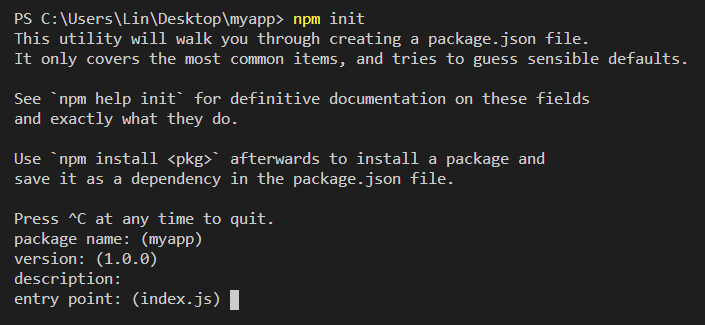

# Getting Started with Express

This section will focus on helping you set up an [**Express.js**](https://expressjs.com/) (or informally known as *Express*). It is a web application framework for [**Node.js**](https://nodejs.org/) that is free and open-source. Express is used to provide server-side logic for web and mobile applications.

## Pre-Installation Steps for Express

Before we begin with the installation, you need to create a folder will be used to store your application. This can be done through the graphical user interface (GUI) or through the Terminal in [**Visual Studio Code**](https://code.visualstudio.com/download) (VSC).

In order to provide better clarity, this guide will focus on providing instructions and screenshots for the Terminal in VSC.

1. Open VSC and look for the navigation bar and select [File] > [Open Folder] to find the new folder that you created.

2. Select [Terminal] > [New Terminal] from the navigation bar to open a Terminal window inside VSC.

   At this point, a new Terminal window will open. Please note that the Terminal window will be used for the majority of this section, so you will want to keep it open.

   

3. Type the command below to create a package.json file.
   > npm init

   At this point, you will be prompted to create a package.json file. For the purpose of this guide, you can go ahead and press enter 3 times or until you see a prompt to create an **entry point**.

   

4. Type the text below and press enter to name your entry point.
   > app.js

5. Press enter until you have successfully created a package.json file.

   !!! Success
   If you have successfully completed this step, you should see a package.json file inside of the Explorer tab in the vertical navigation bar.

   

## Installation Steps for Express

1. Type the text below to install Express:
   > npm install express

   !!! Success
   You will see the Terminal begin to download Express. Once successful, you will see a new folder called **node_modules** and a file called **package-lock.json** in the Explorer tab of your project.

   

## Starter Code for Express

1. Select [File] > [New File] from the navigation bar and name the file "app.js".

2. Type the code below inside of your app.js file:

  ``` {.js .annotate}
   const express = require('express'); (1)
   const app = express(); (2)
   const port = 3000; (3)

   app.get('/', (req, res) => { (4)
     res.send('Hello World!'); 
   })

   app.listen(port, () => { (5)
     console.log(`Example app listening at http://localhost:${port}`);
   })
   ```

   1. This line of code will import the express module into your app.js entry point file.
   2. This line of code will create a new Express application.
   3. This line of code will store the number of the port that we will be using to connect to your localhost.
   4. The GET method route will allow our application to send the string "Hello World!" as a response when we connect to our localhost. You will be learning more about HTTP methods like GET in a later section.
   5. The app.listen() function is used to listen to a specified port for connections. For this application, we are using port 3000.

## Run Express

1. Type the text bellow in the Terminal.
   > node app.js

2. Open your internet browser of choice and type the text below into the address bar.
   > localhost:3000

   !!! Success
    Once the page loads, you should see "Hello World!" in your browser. This means that you have successfully installed and created your first working server!

   

## Conclusion

By the end of this section, you will have successfully learned the following:

- Used the Terminal to install Express
- Imported an Express module into your app.js file
- Created a working Express server on your localhost on port 3009

Great job 🤗. You can go ahead and click on the link below to move on to the next step:

**[Adding Routes]()**