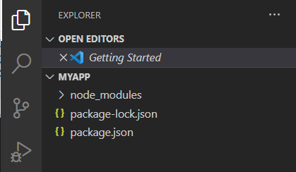
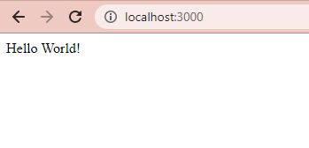

# Getting Started with Express

This section will focus on helping you set up an [**Express.js**](https://expressjs.com/) (or informally known as *Express*). It is a web application framework for [**Node.js**](https://nodejs.org/) that is free and open-source. Express is used to provide server-side logic for web and mobile applications.

## Installation Steps for Express

In the introduction, you will have created a new project folder with all of the subfolders and subfolders required to create your Express server by using commands in the Terminal.

1. Type the command below to install Express from the Terminal:
   > npm install express

   !!! Success
   You will see the Terminal begin to download Express. Once successful, you will see a new folder called node_modules and a file called package-lock.json in the Explorer tab of your project.

   

## Starter Code for Express

In this section, you will learn what code is needed to get your Express server working.

1. Select [File] > [New File] from the navigation bar and name the file "app.js".

2. Type or copy and paste the code below inside of your app.js file:

  ``` {.js .annotate}
   const express = require('express'); // (1)
   const app = express(); // (2)
   const port = 3000; // (3)

   app.get('/', (req, res) => { // (4)
     res.send('Hello World!'); 
   })

   app.listen(port, () => { // (5)
     console.log(`Example app listening at http://localhost:${port}`);
   })
   ```

   1. This line of code will import the express module into your app.js entry point file.
   2. This line of code will create a new Express application.
   3. This line of code will store the number of the port that we will be using to connect to your localhost.
   4. The GET method route will allow our application to send the string "Hello World!" as a response when we connect to our localhost. You will be learning more about HTTP methods like GET in a later section.
   5. The app.listen() function is used to listen to a specified port for connections. For this application, we are using port 3000.

## Run Express

In this last section, you will learn how to run your Express server on your **localhost**. You will be able to see the string "Hello World" from earlier in your internet browser by visiting your localhost:3000.

1. Type the text bellow into the Terminal.
   > node app.js

2. Open your internet browser of choice and type the text below into the address bar.
   > localhost:3000

   !!! Success
    Once the page loads, you should see "Hello World!" in your browser. This means that you have successfully installed and created your first working server!

   

## Conclusion

By the end of this section, you will have successfully learned the following:

- [x] Used the Terminal to install Express
- [x] Imported an Express module into your app.js file
- [x] Created a working Express server on your localhost on port 3009

Great job 🤗. You can go ahead and click on the link below to move on to the next step:

**[Adding Routes](/pages/routes)**
